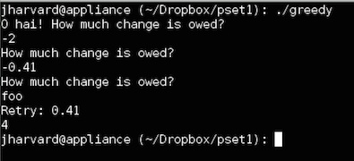

Greedy
======

greedy.c is a program I created for CS50. It asks for a user's input to see how much change is owned, and it outputs the minimum number of coins (1¢, 5¢, 10¢, 25¢) using greedy algorithm. If a user fails to input the change in the expected format, the program will keep asking for other inputs.  

